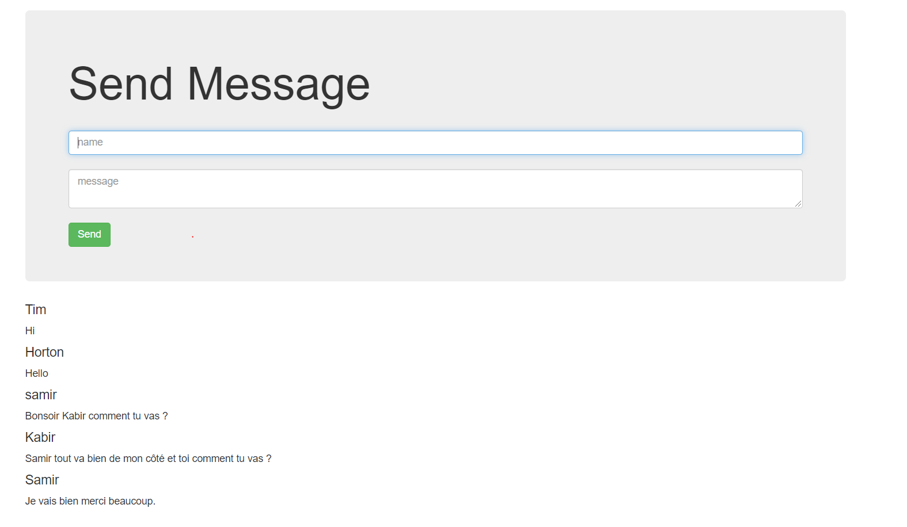

# Chat-Client-App-Browser
This is a small chat application in the browser using Socket.io
# Screenshots
 
# Tech/Framework
* Node.js
* Express
* Socket.IO

# How to use ?
Go to the link bellow to install Node.js  
https://nodejs.org/en/download/

Clone this  repository using the terminal run this command  
git clone https://github.com/Samirtchak/Chat-Client-App-Browser.git

Now you need to install express run the command bellow in your terminal
<h4> npm install express --save </h4> 
Now run this command
<h4> npm install socket.io</h4>
After all the setup you can now run this command to connect to the server
<h4> node server.js</h4>
